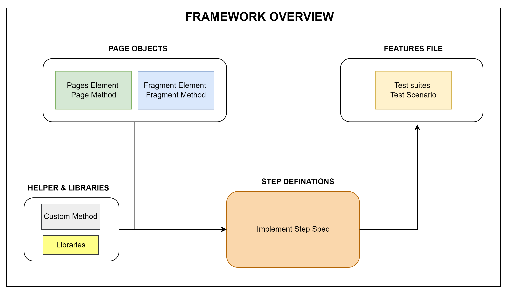
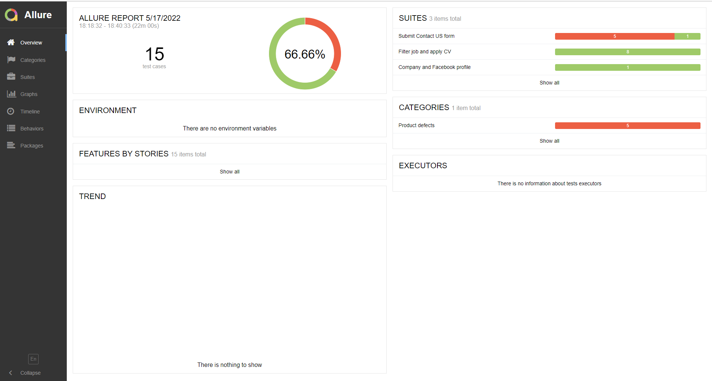

# Automation Framework by CodeceptJS

This project is building the UI automation framework based that using CodeceptJS and other libraries to simplify the
test suite.

## What containing in this automation framework?

- Support running multiple browsers and supporting parallel execution base on annotation settings.
- Support BDD by using feature file to define the test suite/test cases and test data in gherkin format.
- Support auto generating test data by using Faker library.
- Ability to capture pictures while failed any steps from test case then retry the failed steps/scenario automatically to reduce flaky test cases.
- Using Page object model format to define the object of web page.
- Support generate report with Allure command-line.

## Framework overview:
[](img.png)


## Prerequisites:

- Installed Node.js and npm (Node Package Manager).
- Installed CodeceptJS and necessary libraries (faker, chai).
- The target web browsers should be installed and configured in the system.

## How to Install and config the framework?
#### Install the framework
Just run the following command after cloned the repository to install the framework:

```shell
cd <to the local repository>
npm install
```
#### Config the ramework
From the codecept.conf.js file, we have serveral options to adjust our test framework following below:
- Multiple browsers and parrallel execution settings:
```js
multiple: {
  basic: { // To define annotation, that trigger this run
    browsers: ['chrome', 'firefox'] //To define target browsers will be run with this annotation
  },
  smoke: {
    parallel: {
      browsers: ['chrome'],
              chunk: 2 //Triggering parallel test: [number] is how many test scenario are running in the same time.
    },
  }
},
```

- Define page object model:
```js
 include: {
        I: './steps_file.js',
        common: './webcommon_helper.js',
        homePage: './pages/home.js',
        companyPage: './pages/company.js',
        careerPage: './pages/career.js',
        Fragment: './fragments/fragment.js',
    },
```
## How to define the test suite?
- We define the test suites and test scenario in the feature file in [BDD](https://en.wikipedia.org/wiki/Behavior-driven_development) with [Gherkin syntax](https://cucumber.io/docs/gherkin/).
- Step definition is defined the test steps that using in the test scenario.


## How to use this automation framework?
- Very simple, just run the command line to trigger all test suites:
```bash 
 npm run codeceptjs:features
```
- When finished all test suites, you can generate the report by using the command line:
```bash 
 npm run codeceptjs:report
```
Then the allure report server will be triggered and displayed the latest run on your default web browsers:[](img.png)


## TODO:

- Bypass captcha function (Ideally to using voice recognition then convert to text to bypass captcha).
- Support visual testing by using ResembleJS library.
- Add more features to automation framework that support testing on mobile devices (Could do the testing on both simulator and real devices).
- Enhance the stability while running the automation framework.


## References:
- Frameworks and Concept: [CodeceptJS](https://codecept.io/), [Gherkin](https://cucumber.io/),[BDD](https://en.wikipedia.org/wiki/Behavior-driven_development)
- Libraries: [Faker](https://github.com/faker-js/faker), [Chai](https://www.chaijs.com/), [ResembleJS](https://github.com/rsmbl/Resemble.js),[Allure](https://allure.io/)

[](https://stand-with-ukraine.pp.ua)
